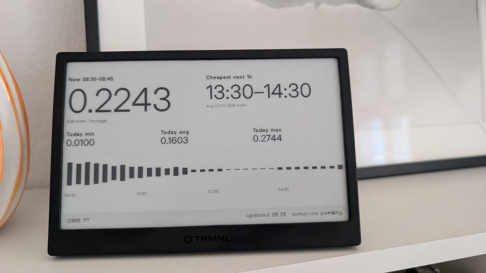
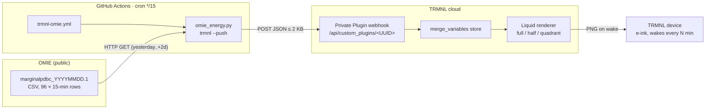
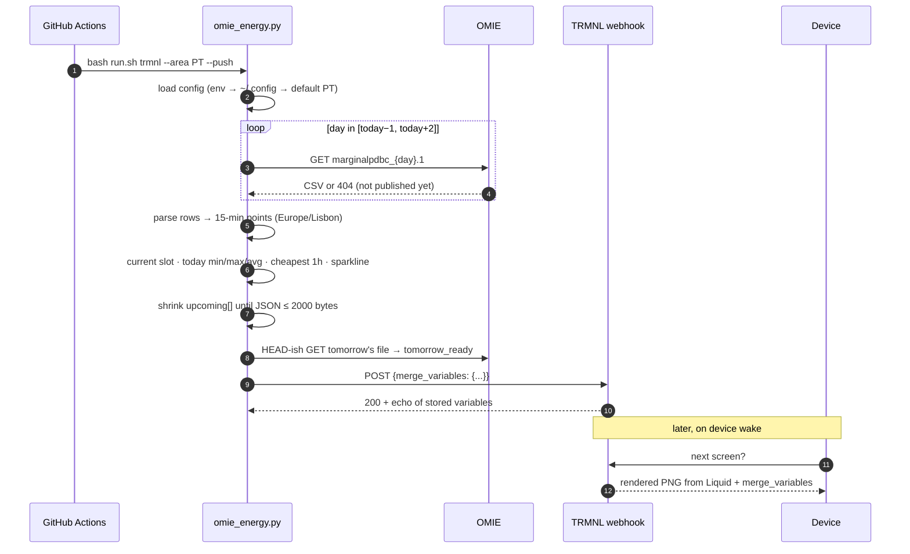
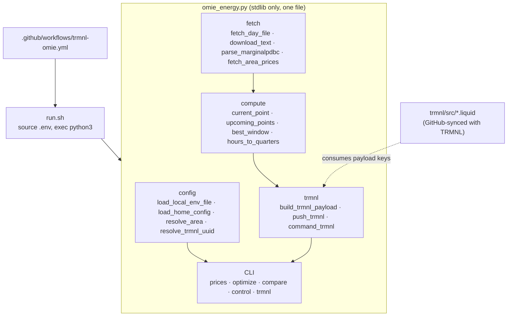
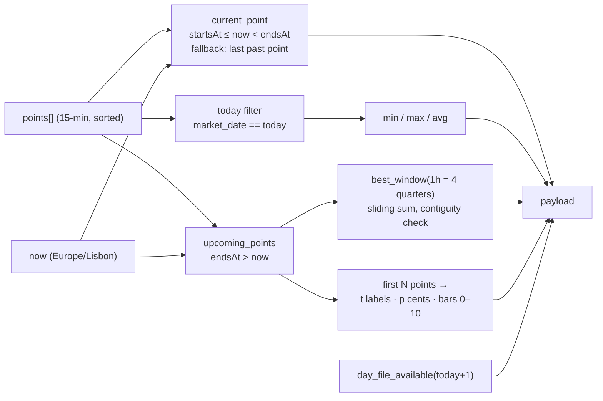
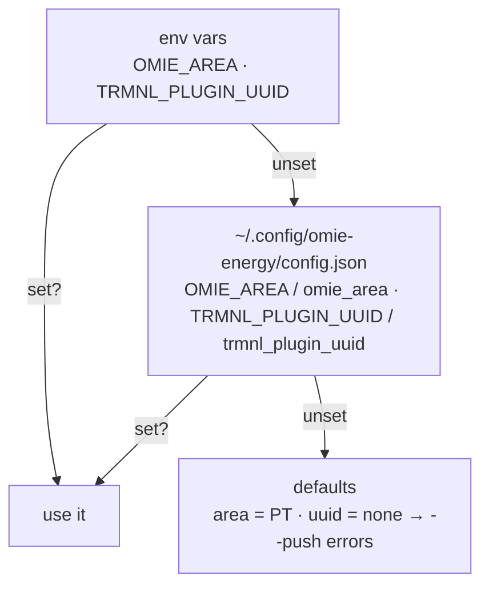

# trmnl-omie

Iberian day-ahead electricity prices (OMIE, Portugal / Spain, 15-minute periods) on a [TRMNL](https://trmnl.com) e-ink display.



*Live Private Plugin: current 15-min slot, cheapest next hour, today’s min/avg/max, and upcoming sparkline.*

A GitHub Actions cron runs a single stdlib-only Python script every 15 minutes. The script downloads OMIE's public price file, computes the current slot, today's stats, the cheapest upcoming window and a sparkline, and POSTs a compact JSON payload to a TRMNL Private Plugin webhook. TRMNL renders it with the Liquid markup in this repo and the device pulls the image on its next wake.

No API keys for price data. The only secret is the TRMNL plugin UUID.

---

## Table of contents

- [How it works](#how-it-works)
  - [System overview](#system-overview)
  - [Data flow, one push](#data-flow-one-push)
  - [Where the time goes](#where-the-time-goes)
- [Architecture](#architecture)
  - [Components](#components)
  - [Data source: OMIE `marginalpdbc`](#data-source-omie-marginalpdbc)
  - [Payload](#payload)
  - [Rendering](#rendering)
  - [Configuration precedence](#configuration-precedence)
- [Setup](#setup)
- [Local use](#local-use)
- [Serving a public JSON endpoint](#serving-a-public-json-endpoint)
- [Publishing as a TRMNL recipe](#publishing-as-a-trmnl-recipe)
- [Repo layout](#repo-layout)
- [Design decisions](#design-decisions)
- [Attribution](#attribution)
- [License](#license)
- [Related](#related)

---

## How it works

### System overview



Two independent loops, decoupled by TRMNL's `merge_variables` store:

| Loop | Driver | Cadence | What it does |
|---|---|---|---|
| **Push** | GitHub Actions cron | every 15 min | fetch OMIE → compute → POST payload |
| **Pull** | TRMNL device firmware | playlist refresh (15–30 min) | fetch rendered image, sleep |

The device never talks to this repo or to OMIE. TRMNL always has the last successful payload, so a failed push just means a stale slot label, not a blank screen.

### Data flow, one push



### Where the time goes

```mermaid
gantt
    title Timing on a typical day (Europe/Lisbon)
    dateFormat HH:mm
    axisFormat %H:%M
    section OMIE
    Today's file available (published D-1 ~13:00)   :done, 00:00, 24h
    Tomorrow's file published                        :milestone, 13:00, 0m
    section Push loop
    Cron every 15 min                                :active, 00:00, 24h
    section Payload
    tomorrow_ready = false                           :00:00, 13h
    tomorrow_ready = true                            :13:00, 11h
```



Prices only change once a day when OMIE publishes. The 15-minute cron exists to move the "Now" slot label, recompute the cheapest-next window from the current time, and flip `tomorrow_ready` in the afternoon. Treat the 13:00 milestone as
approximate: on 2026-09-23 tomorrow's file was still 404 at 13:20 Europe/Lisbon.

---

## Architecture

### Components



- **`run.sh`** loads a local `.env` if present, then `exec`s the script. Keeps secrets out of shell history and out of the workflow file.
- **`omie_energy.py`** is one file on purpose: copy it anywhere with Python 3.9+ and it runs. Dependencies are `urllib`, `csv`, `json`, `zoneinfo`, `argparse`.
- **Liquid templates** are the only TRMNL-side code. They read payload keys, nothing else. The plugin is connected to this repo via TRMNL's GitHub sync, so edits in `trmnl/src/` on `main` land in the plugin and edits in the TRMNL editor come back as "Updated from TRMNL" commits.
- **Workflow** is 30 lines: checkout, setup-python, run with `OMIE_AREA=PT` and the secret.

### Data source: OMIE `marginalpdbc`

OMIE publishes one file per market day:

```
https://www.omie.es/en/file-download?parents=marginalpdbc&filename=marginalpdbc_YYYYMMDD.1
```

Format (semicolon CSV, header line `MARGINALPDBC;`, trailer `*`):

```
year;month;day;period;price_PT;price_ES;
2026;09;23;1;95.10;95.10;
2026;09;23;2;90.02;90.02;
...
2026;09;23;96;110.45;108.90;
*
```

- **period** 1..96 = 15-minute slots starting 00:00 Iberian local time. Period 1 is `00:00–00:15`.
- **price** in EUR/MWh. The script divides by 1000 for EUR/kWh.
- Column 4 is Portugal, column 5 is Spain (`AREA_PRICE_INDEX`).
- DST transition days may carry 92 or 100 rows. The parser keeps whatever is there.
- A 404, an HTML body, or a body not starting with `MARGINALPDBC` all mean "not published yet" and return `None` instead of raising.

Default fetch window is **yesterday → today+2**. Yesterday guarantees a "current" point just after midnight before today's file is confirmed; +2 is harmless over-fetch that just 404s.

### Payload

`build_trmnl_payload` produces this shape (PT example, trimmed):

```json
{
  "area": "PT",
  "area_label": "Portugal",
  "updated_at": "2026-09-23T08:39:16+01:00",
  "updated_label": "08:39",
  "current": {
    "price_eur_kwh": 0.2243,
    "price_eur_mwh": 224.31,
    "price_cents_kwh": 22,
    "price_label": "0.2243",
    "starts_at": "2026-09-23T08:30:00+01:00",
    "ends_at":   "2026-09-23T08:45:00+01:00",
    "slot_label": "08:30–08:45"
  },
  "today": { "min": 0.01, "max": 0.2744, "avg": 0.1603 },
  "today_min_label": "0.0100",
  "today_max_label": "0.2744",
  "today_avg_label": "0.1603",
  "cheapest_next": {
    "starts_at": "...", "ends_at": "...",
    "label": "13:00–14:00",
    "avg_eur_kwh": 0.0312, "avg_cents_kwh": 3, "quarters": 4
  },
  "upcoming": {
    "t":     ["08:30", "08:45", "..."],
    "p":     [22, 19, "..."],
    "bars":  [10, 8, "..."],
    "count": 32
  },
  "tomorrow_ready": false
}
```

How each block is computed:



- **`best_window`** is a plain sliding window over `upcoming`, rejecting any chunk whose consecutive timestamps aren't exactly 15 min apart (guards DST gaps and missing rows). Cheapest = lowest sum of EUR/kWh.
- **`bars`** are min-max normalised to integers 0–10 so Liquid can do `height: {{ h | times: 10 }}%` without floats.
- **Size guard**: TRMNL's webhook guidance is ~2 KB. If the compact JSON exceeds 2000 bytes, `upcoming_count` is retried at 24, 16, 12, 8, then the run fails if the payload is still oversized. Typical PT payload is ~1.1 KB at 32 points. Applies to `--push` only: the polling file is served over HTTP and is never truncated.
- **`tomorrow_ready`** costs one extra GET but lets the template say "tomorrow's prices published" without a second data path.

### Rendering

TRMNL stores the POSTed `merge_variables` and re-renders on each device fetch. The templates only use these keys:

| Template | Uses |
|---|---|
| `full.liquid` | `current.*`, `cheapest_next.*`, `today_*_label`, `upcoming.bars`, `upcoming.t`, `upcoming.count`, `area`, `area_label`, `updated_label`, `tomorrow_ready` |
| `half_vertical.liquid` | subset: current, cheapest next, today stats |
| `quadrant.liquid` | current price + slot, cheapest next label |

The sparkline is a CSS-only bar chart: a `grid--cols-{{ upcoming.count }}` with one `div` per bar whose height is `bars[i] × 10 %`. Time labels are thinned to every `count / 4`th slot to fit the 800 px width.

### Configuration precedence



`run.sh` sources `./.env` into the environment before Python starts, so a local `.env` is just "env vars" in this diagram. In GitHub Actions the workflow sets both directly.

---

## Setup

1. **TRMNL → Plugins → Private Plugin → Add.** Strategy **Webhook**. Name it, save. Copy the UUID from the webhook URL `https://trmnl.com/api/custom_plugins/<UUID>`.
2. **Markup.** Either connect the plugin to this repo (plugin → *Connect to GitHub*, folder `trmnl`) so `trmnl/src/*.liquid` and `settings.yml` sync both ways, or paste each file from [`trmnl/src/`](trmnl/src/) into its layout tab manually.
3. **Test from your machine** before touching CI:
   ```bash
   export TRMNL_PLUGIN_UUID="<uuid>"
   bash run.sh trmnl --area PT --push
   # → Pushed to TRMNL (200): {...}
   ```
4. **Enable the cron:**
   ```bash
   gh secret set TRMNL_PLUGIN_UUID -R <you>/trmnl-omie
   gh workflow run trmnl-omie.yml -R <you>/trmnl-omie
   gh run watch -R <you>/trmnl-omie
   ```
5. **Playlist.** Add the plugin to your device playlist. Any refresh interval
   that covers one cron cycle works; 15–30 min is what this setup uses.

For Spain, set the repository variable instead of editing files — both
workflows read it:

```bash
gh variable set OMIE_AREA -b ES -R <you>/trmnl-omie
``` Field-by-field payload reference and troubleshooting: [`trmnl/SETUP.md`](trmnl/SETUP.md).

---

## Local use

The same script is a general OMIE CLI / agent skill.

```bash
bash run.sh trmnl --area PT                 # print payload, no push
bash run.sh trmnl --area PT --push          # push once
bash run.sh trmnl --area PT --out dist/prices-pt.json  # JSON for a polling URL
bash run.sh trmnl --area PT --max-age-min 45 --out out.json  # fail if data is stale
bash run.sh trmnl --area PT --envelope --out wrapped.json    # {"merge_variables": {...}}

bash run.sh prices --area PT --hours 8      # next 32 periods
bash run.sh prices --area ES --hours 36
bash run.sh compare --hours 24              # PT vs ES side by side

bash run.sh optimize --area PT --duration-hours 2      # cheapest 2h from now
bash run.sh optimize --area PT --kwh 28 --power-kw 11  # duration from energy/power

# dry-run: prints which command would fire
bash run.sh control --area PT --price-below 0.10 \
  --on-command "echo on" --off-command "echo off"
# add --execute to actually run them
```

Thresholds for `optimize` / `control` are **EUR/kWh**. All timestamps are `Europe/Lisbon`.

---

## Serving a public JSON endpoint

The webhook path needs a plugin UUID and something to run the cron. If you want
the same payload readable by anything -- including a TRMNL plugin using the
**Polling** strategy, which installs with no secret and no fork -- publish it as
a static file instead:

```bash
bash run.sh trmnl --area PT --out dist/prices-pt.json
```

`--out` writes the payload atomically (unique temp file, then `rename`) and can
be combined with `--push` to do both in one run -- push happens first, so a
rejected webhook leaves no fresh file behind. When both are passed, the file
holds the same post-shrink payload the webhook received. `--max-age-min N` refuses to
publish when the active slot ended more than N minutes ago, which keeps a stale
payload out of CI; `--envelope` wraps the file as `{"merge_variables": {...}}`
if TRMNL turns out to expect the webhook body shape instead of the bare object;
the workflow serves both shapes when the `ENVELOPE` repository variable is `1`.

[`.github/workflows/publish-json.yml`](.github/workflows/publish-json.yml) does
this every 15 minutes for **both** areas and force-pushes the result to a
`gh-pages` branch:

```
prices-pt.json
prices-es.json
```

Two areas, two files, so switching area never overwrites the other one. Each
run also fails if it cannot build a payload fresher than 45 minutes.

**Verify the URL before trusting it.** The `gh-pages` branch existing does not
mean the file is served. Enable Pages once under **Settings -> Pages -> Deploy
from a branch -> `gh-pages` / (root)**, then check the URL that actually
answers rather than assuming the shape:

```bash
curl -sL -o /dev/null -w '%{http_code}\n' https://<pages-host>/prices-pt.json   # want 200
curl -sL https://<pages-host>/prices-pt.json | head -c 200                        # want {"area"
```

Two traps, both observed on this repo's own account:

- A free plan cannot enable Pages on a **private** repository (the API answers
  `422: Your current plan does not support GitHub Pages for this repository`).
  Either make the repository public, use a paid plan, or serve `dist/` from any
  other static host — nothing in the plugin depends on GitHub Pages.
- If the account has a **custom domain** on its user site, every
  `<owner>.github.io/...` URL 301-redirects to that domain, so the working
  address is `https://<custom-domain>/<repo>/prices-pt.json`, not the
  `github.io` one. Use `curl -sIL` (follow redirects) or you will read the
  redirect body and think the file is empty.

Once the URL answers, set it as a repository variable and every deploy run will
self-check that Pages is serving the payload it just built (it compares against
the file the URL names, and unwraps either shape):

```bash
gh variable set POLLING_URL -b "https://<pages-host>/prices-pt.json" -R <you>/trmnl-omie
```

The two workflows are independent: run either, or both.

## Publishing as a TRMNL recipe

This plugin is publishable as a **Recipe** so other people can install it in one
click. Recipe installs are only frictionless with the polling endpoint above;
the webhook path requires every user to fork the repo and add their own secret.

Step-by-step, submission email draft and demo-video script:
[`trmnl/PUBLISH.md`](trmnl/PUBLISH.md).

---

## Repo layout

```
.
├── omie_energy.py              # everything: fetch, compute, CLI, TRMNL push
├── run.sh                      # source .env, exec python3
├── requirements.txt            # comment-only, no packages
├── .env.example                # OMIE_AREA, TRMNL_PLUGIN_UUID
├── config.json.example         # same keys, for ~/.config/omie-energy/
├── .gitignore
├── SKILL.md                    # agent-skill metadata (OpenClaw / ClawHub)
├── LICENSE                     # MIT
├── trmnl/
│   ├── SETUP.md                # TRMNL walkthrough + payload field table
│   ├── PUBLISH.md              # recipe publishing: unlisted -> public
│   ├── polling/
│   │   └── settings.yml.example  # same plugin on the Polling strategy
│   ├── example.jpg             # photo of the live display
│   ├── .trmnlp.yml             # trmnlp dev-server config (watch: src)
│   └── src/                    # synced both ways with the TRMNL plugin
│       ├── settings.yml        # plugin settings (strategy, refresh, id)
│       ├── full.liquid
│       ├── half_vertical.liquid
│       └── quadrant.liquid
└── .github/workflows/
    ├── trmnl-omie.yml          # */15 cron + workflow_dispatch (webhook push)
    └── publish-json.yml        # */15 cron -> gh-pages prices.json (polling)
```

---

## Design decisions

- **Push first, poll for installs.** The webhook push needs nothing hosted; the Polling strategy needs a public URL. Both are built from one payload: the webhook path is the daily driver, polling is what makes a recipe installable by strangers ([Serving a public JSON endpoint](#serving-a-public-json-endpoint)).
- **Stdlib only.** Earlier versions used the `OMIEData` PyPI package. Parsing the CSV directly removed the dependency, removed pandas, and made the 15-minute granularity available (the library exposed hourly).
- **One file.** Skill runners (OpenClaw, Claude Code, Cursor) copy directories around. A single script with no imports beyond stdlib survives that.
- **Compute on the pusher, not in Liquid.** Liquid has no date math and clumsy floats. All labels, rounding and normalisation happen in Python; templates only place strings.
- **Two delivery paths, one payload.** The webhook push and the `gh-pages` JSON come from the same `build_trmnl_payload` output. Polling exists so a published recipe can install without the user owning a cron or a secret.
- **Idempotent pushes.** Every run rebuilds the full payload. No state, no diffing, safe to re-run or run twice.
- **Fail loud in CI, fail soft on data.** Missing secret exits 1. Missing tomorrow's file is normal and returns `None`.

---

## Attribution

Price data comes from **OMIE** (OMI - Polo Espanol, S.A.), the Iberian
day-ahead market operator: [omie.es](https://www.omie.es/en/market-results/daily/daily-market/daily-hourly-price).

OMIE's [legal warning](https://www.omie.es/index.php/en/legal-warning) states
(as read on 2026-09-23) that its public information may be used freely provided
the source is cited and the content is not altered; re-read it before relying
on that for redistribution. This project cites OMIE in the plugin description and in the
README, and presents the published prices unmodified (unit label changed from
EUR/MWh to EUR/kWh). It is an independent reader: not affiliated with, endorsed
by, or supported by OMIE.

Wholesale market prices only -- no retail taxes, network fees or supplier
margins. Nothing here is investment advice.

## License

MIT -- see [LICENSE](LICENSE).

---

## Related

- [omie-energy](https://github.com/pmagnomuller/omie-energy) — original hourly version of this skill
- [ostrom-energy](https://github.com/pmagnomuller/ostrom-energy), [tibber-energy](https://github.com/pmagnomuller/tibber-energy) — sibling skills for German retail tariffs
- [grid-pulse](https://github.com/pmagnomuller/grid-pulse) — energy transparency project this grew out of
- Writeup: [OpenClaw on My Homelab](https://pedro-muller.com/homelab/openclaw-on-my-homelab/)
- TRMNL docs: [Private Plugins](https://help.trmnl.com/en/articles/9510536-private-plugins)
